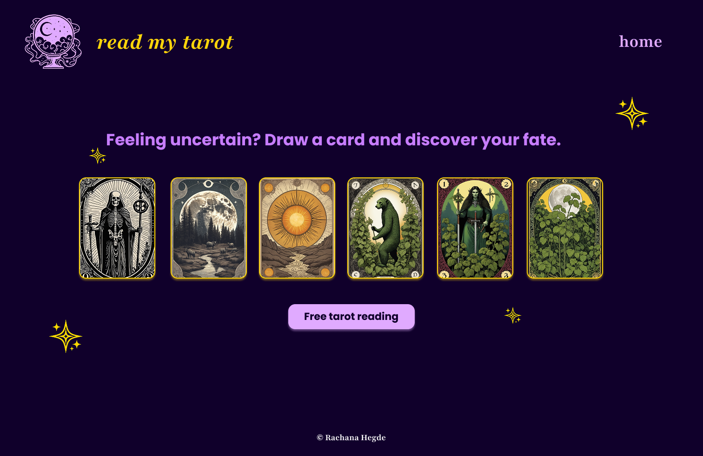
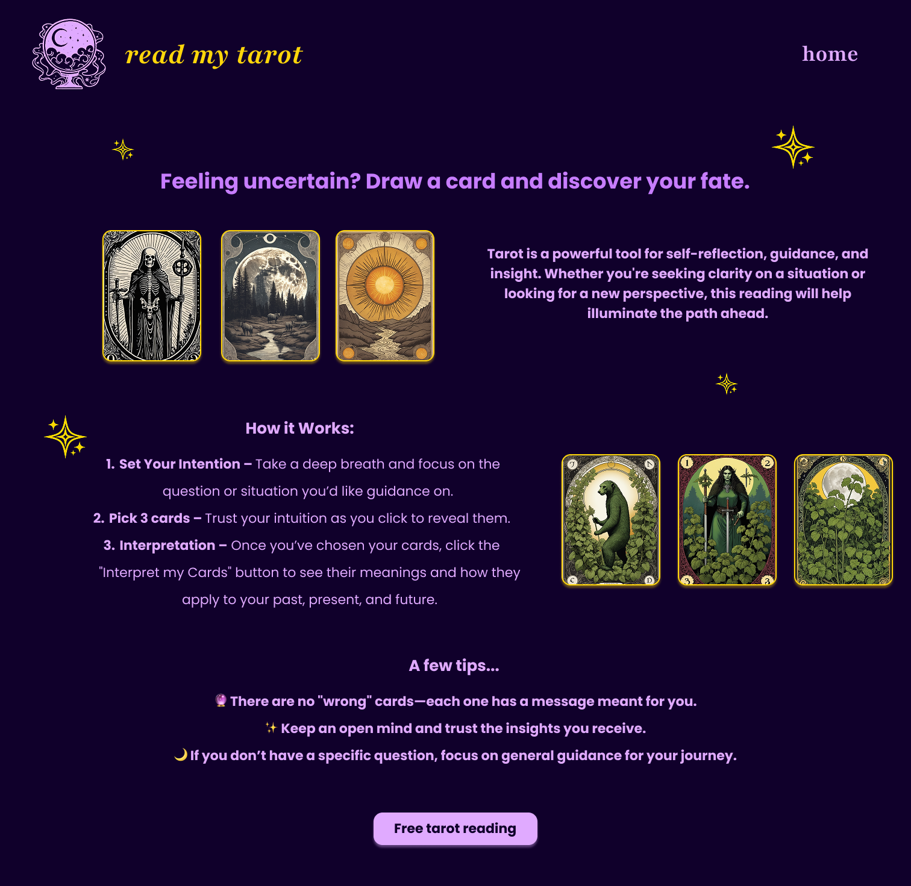
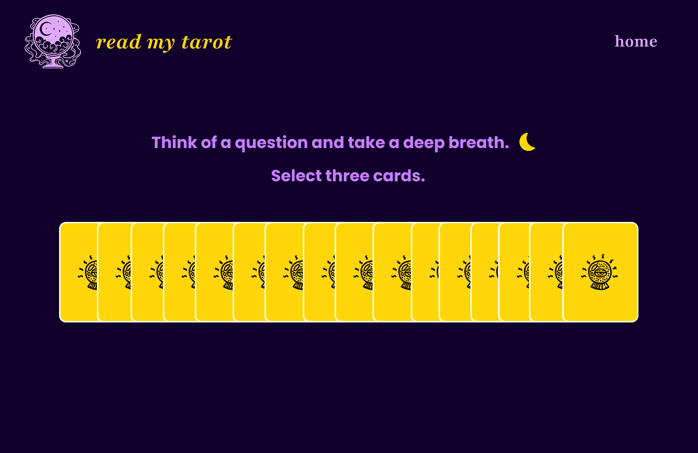
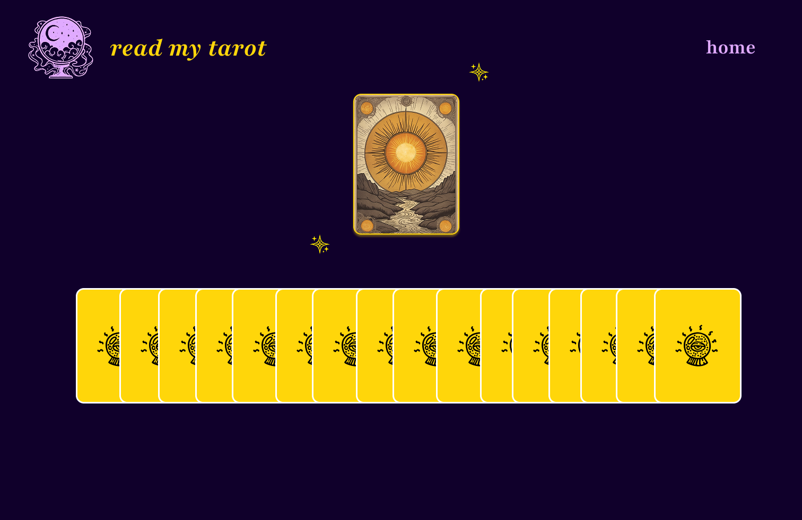
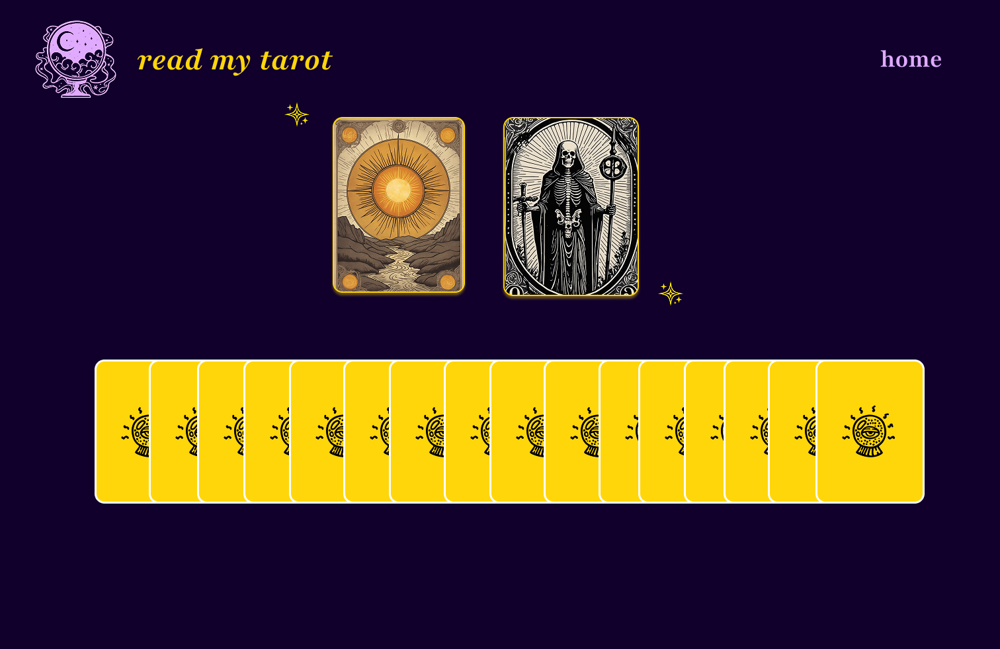
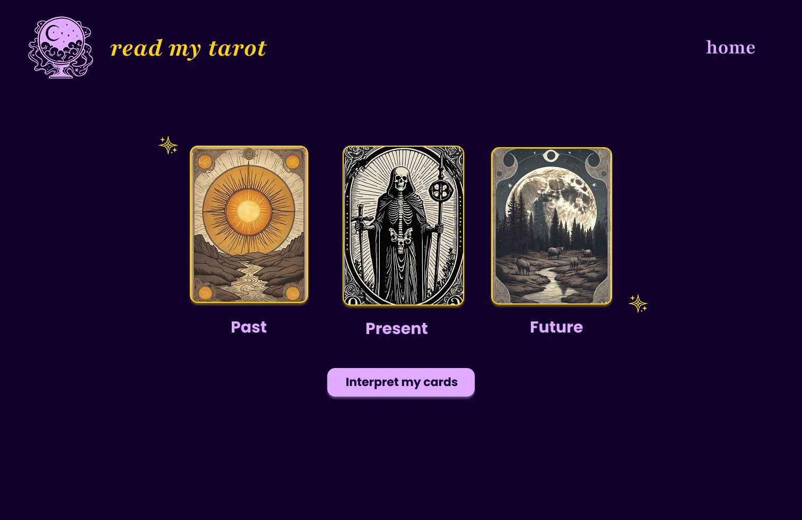
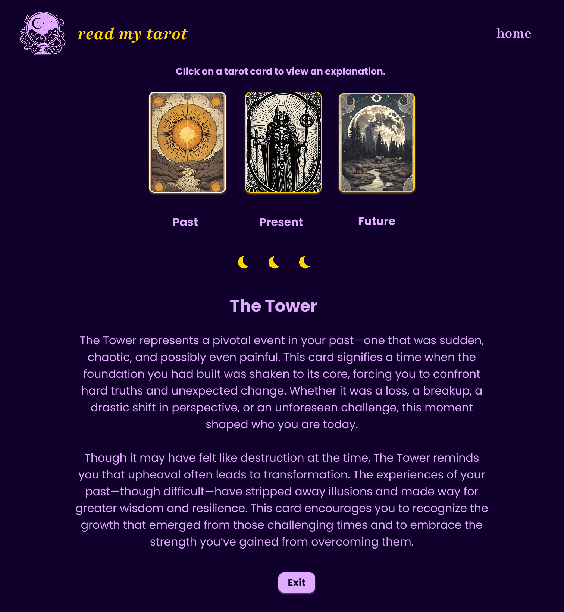
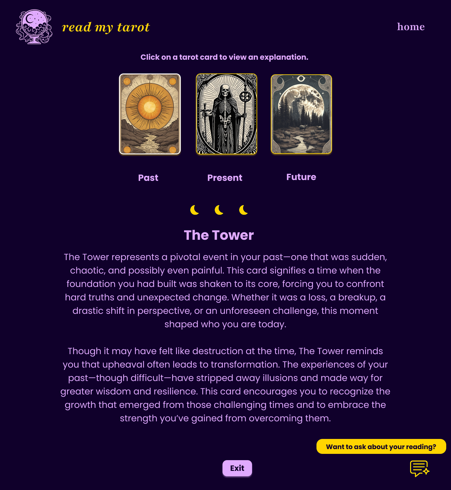
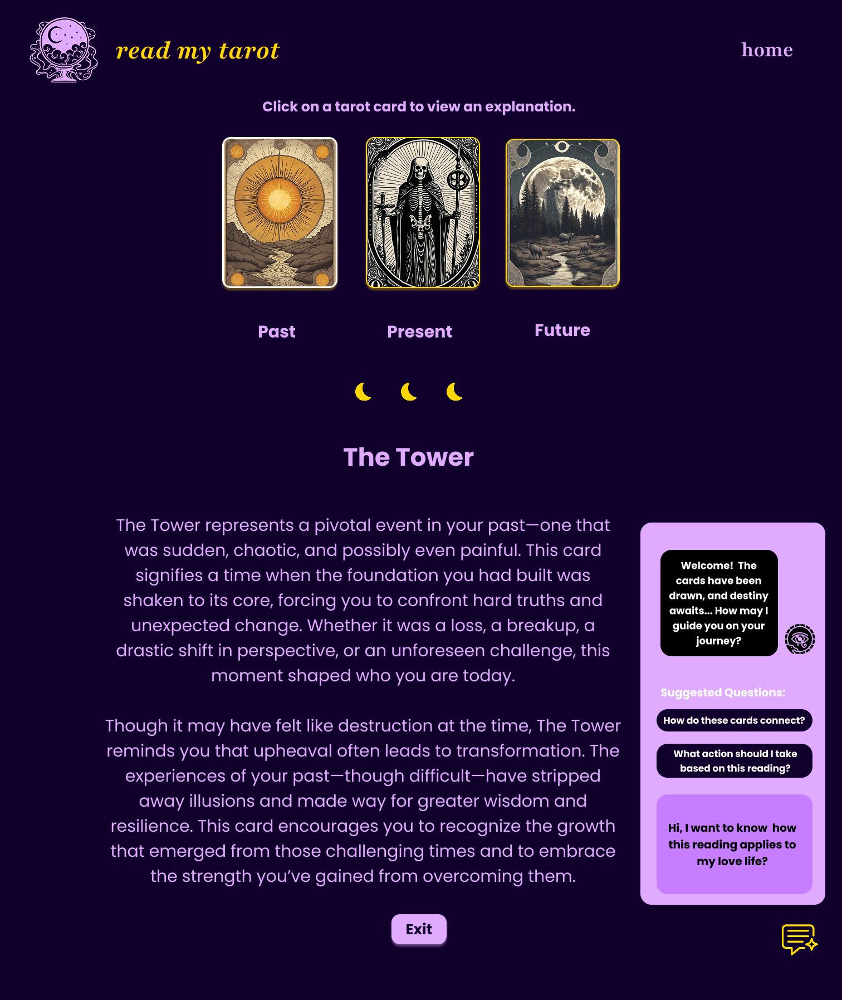

# Tarot Card Reader
Interactive and responsive tarot card reader website built with HTML, Tailwind CSS 4, and vanilla JS. The website is designed in Figma. 

## Design for Desktop Website 
<a href="https://www.figma.com/design/cC7KADvQAishRHZr4dk7tm/Read-my-tarot-website-design?node-id=42-306&t=ExTKXeyPMxl7k7tI-0">Link to Figma design files</a>
Note: The designs are intended to be guidelines so I plan to make changes as I go along because the goal of this project is to become mroe confident with coding in JS and using a popular framework like Tailwind. 

### Landing page version 1

### Landing page version 2 
I chose to build out this version because it provides more insights into how tarot readings work and guidance for people who are less familiar with how to proceed. 

### Tarot reading website pages (including the design for AI chat)

## Design for Mobile 

## Features (currently building) 
- Users can select 3 cards to get a reading on their past, present, and future. 
- Users can also ask an AI virtual assistant questions about their tarot reading and it significance.

## To Do
 -	~Design in Figma – for phone and desktop~
 - ~Flowchart with decision tree for app features~
 - ~Finalise design files~
 - ~Finish building home page with HTML and Tailwind for desktop (minimally responsive with flex)~

-	Generate the card art for all the tarot cards and the associated description
-	Save pathways to card art and descriptions in JSON data file
- Make it responsive for mobile and tablet
