# Tarot Card Reader
Interactive and responsive tarot card reader website built with HTML, Tailwind CSS 4, and vanilla JS. The website is designed in Figma and tested using Responsively. 

## Features
- Users can select 3 tarot cards (with card flip animation).
-	View three card tarot reading with explanations

## Ideas for extending and improving this project
I did not have time to finish building the AI chat even though I have included it in the design files below. Ideally, users will be able to ask an AI virtual assistant questions about their tarot reading and it significance. I chose not to finish this aspect of the project because it required learning to work with Node JS which I haven't learned yet. Without adding more complexity to this project (i.e. in the form of using Node JS, etc.), I wouldn't be able to securely make API calls and this was beyond the scope of what I had planned. 
I also wanted to improve the design for the mobile UI because it's a little more cluttered than I intended. I also recognise that some of the card images aren't precisely the same size as each other which can affect the layout of the page in minor ways. However, due to time cosntraints, I felt it would be best to move on. 

### AI Chat Functionality Design (for future additions) 
 * Open the AI chat window, which allows users to ask questions about their tarot card reading.
 * The AI chat window is a fixed position div on the right hand side of the page.
 * It contains a header, a default AI question, suggested questions, a chat input box, and a send button.
 * When the user types a question into the chat input box and clicks the send button, the AI response is displayed below the chat input box.

## Screenshots of Desktop Website
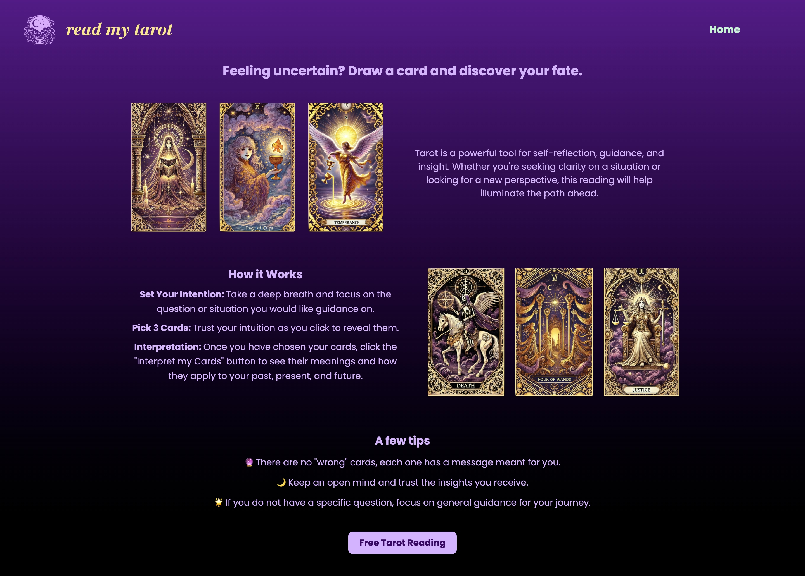
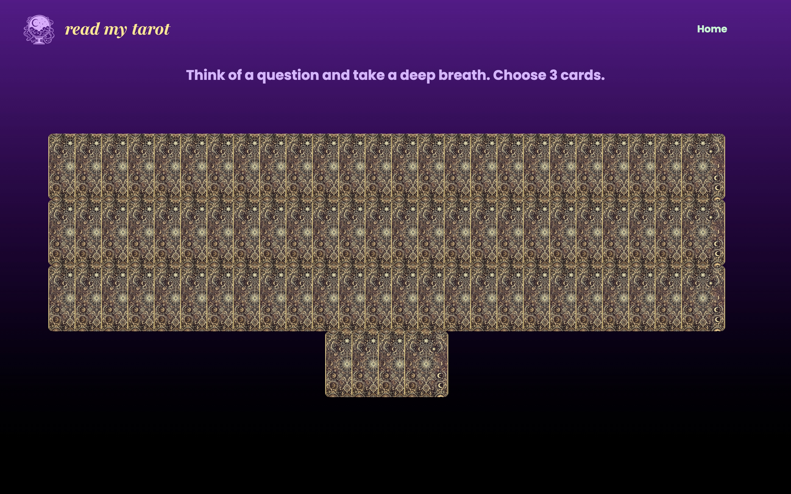
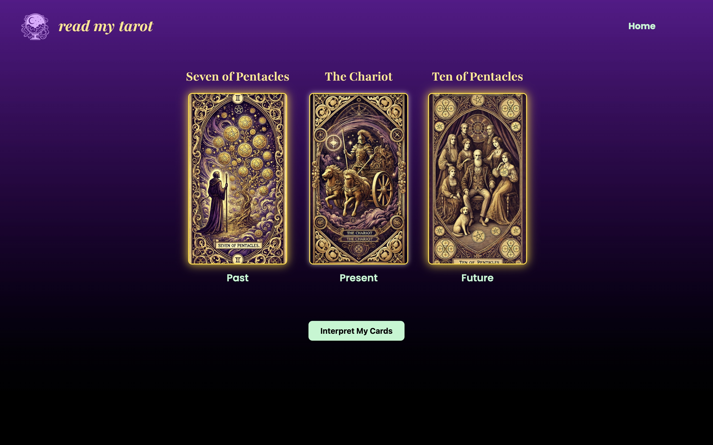
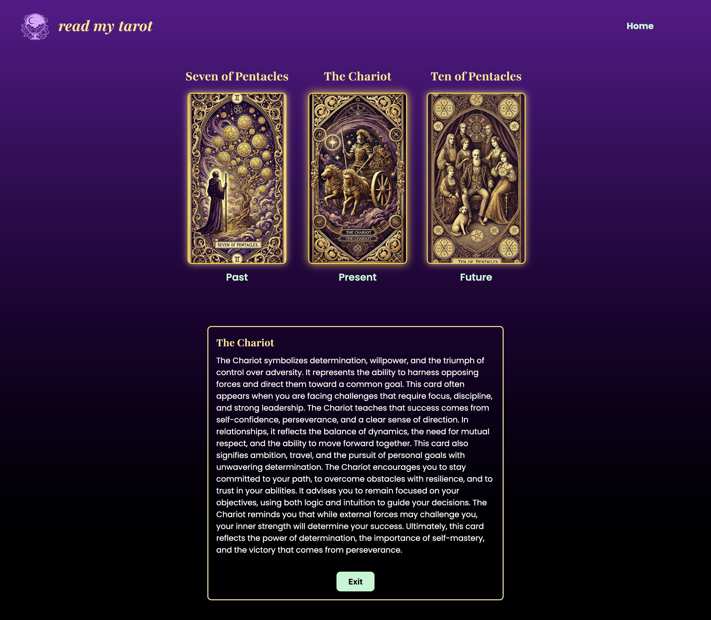

## Screenshots of Mobile Website
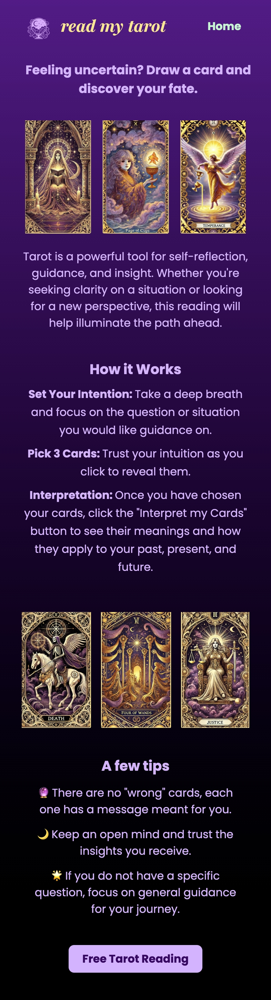
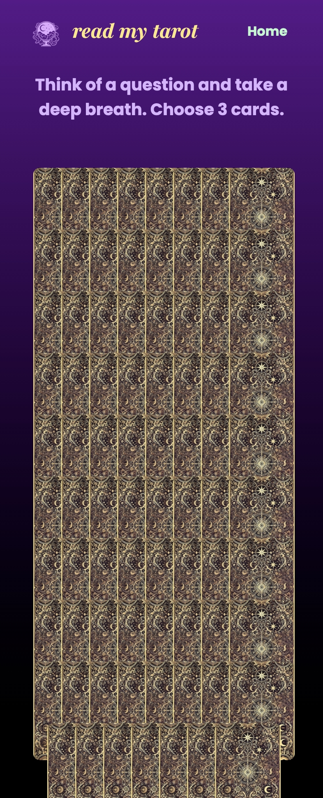
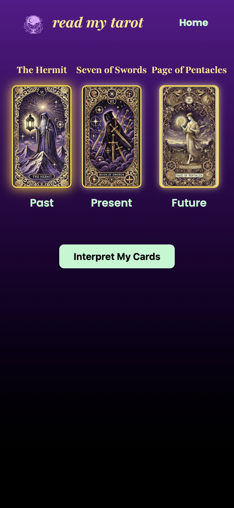
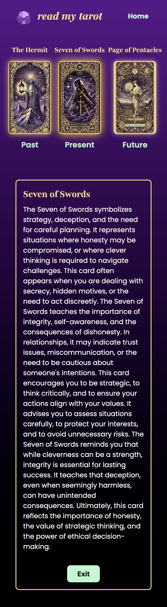

## Screenshots of iPad Website
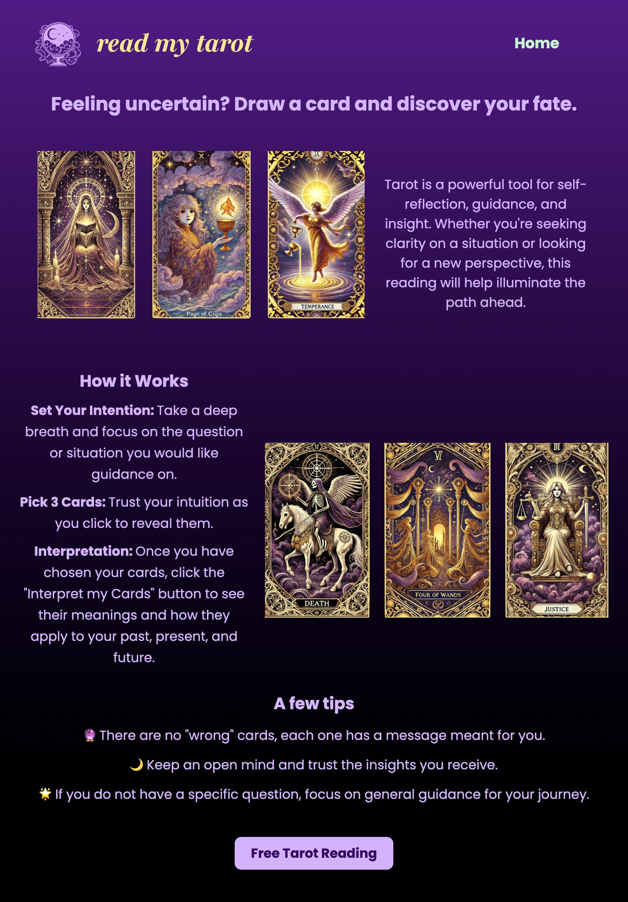
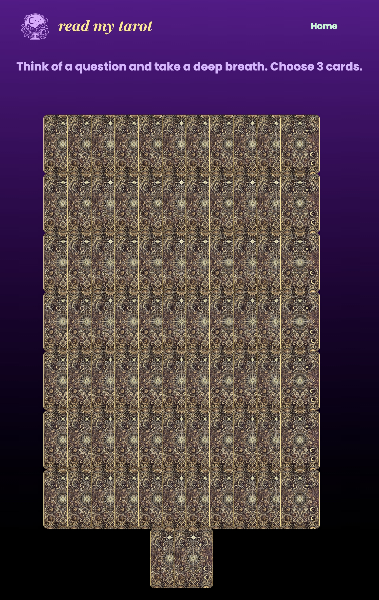
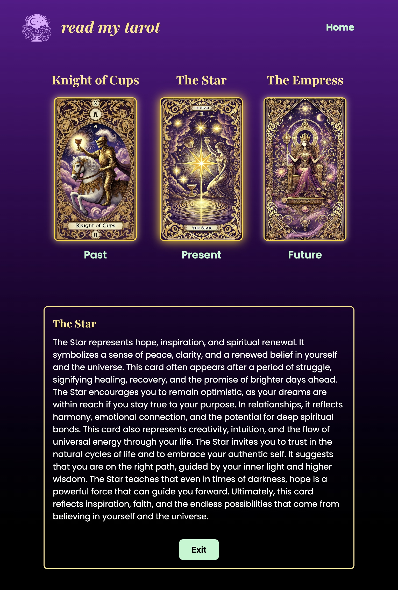

## Design for Desktop Website 
<a href="https://www.figma.com/design/cC7KADvQAishRHZr4dk7tm/Read-my-tarot-website-design?node-id=42-306&t=ExTKXeyPMxl7k7tI-0">Link to Figma design files</a>
Note: The designs are intended to be guidelines so I plan to make changes as I go along because the goal of this project is to become mroe confident with coding in JS and using a popular framework like Tailwind. 

### UI Design: Landing page version 1

### UI Design: Landing page version 2 
I chose to build out this version because it provides more insights into how tarot readings work and guidance for people who are less familiar with how to proceed. 

### UI design for tarot reading website pages (including the design for AI chat)

## Design for Mobile 
      
    
  

## Completed To Do List
 -	Design in Figma – for phone and desktop
 - Flowchart with decision tree for app features
 - Finalise design files
 - Finish building home page with HTML and Tailwind for desktop (minimally responsive with flex)
 - Generate the card art for all the tarot cards and the associated description
 - Save pathways to card art and descriptions in JSON data file
 - Build the tarot reading page using javascript and CSS for animations and DOM changes
 - Display three card reading with explanation associated with each card below
 - Make website responsive for mobile and tablet with flexbox and CSS grid within Tailwind

## Implementation
Technologies used:
-	HTML
-	Tailwind (CSS framework for responsiveness)
-	Vanilla JS – logic for shuffling, selecting + displaying card meanings, also interactions with AI API
-	JSON – storing tarot card data

## Reflections on the learning process & challenges faced
The main challenge that I faced was getting to grips with the Tailwind framework and understanding how to customise the default Tailwind theme in input.css. I was also confused by the process of adding animations using solely Tailwind and switched to writing pure CSS in order to implement the card flip animations. In terms of the user interface, my goal was to design a simple but engaging platform with colors of purple and gold which evoke the mysticism of tarot. I also chose symbols associated with tarot including the crystal ball which is the main icon at the top of the page. It was exciting to work on my UI design skills again and I used Figma to create the design files that guided my coding project. I also reviewed Javascript concepts such as DOM manipulation and event handling and learned how to implement responsive design with Tailwind breakpoints. I chose not to add any custom breakpoints because it seemed unnnecessary since the Tailwind breakpoints were already designed to apply to a variety of devices. When testing the website, I used Responsively on my Macbook Pro to evaluate the website's appearance on the following devices: Macbook Pro, iPhone 15 Pro, iPhone 16 Plus, and iPad. I believe these four devices encompass a range of screen sizes and the testing conducted indicates that the website should also function equally well on non Apple devices with similar screen sizes. 

## Extra features to add in future versions
🔮 Users can choose from different types of tarot readings  
🔮 Randomize card orientation to provide readings on upright or reversed cards
🔮 Add Sound Effects & Background Music  
🔮 Custom Themes – Dark mode, different tarot deck styles.
🔮 Shareable Results – Allow users to share their tarot reading on social media.

## Image and icons attribution
- Background image - Photo by Manny Becerra on Unsplash 
- Crystal Ball by Imogen Oh from <a href="https://thenounproject.com/browse/icons/term/crystal-ball/" target="_blank" title="Crystal Ball Icons">Noun Project</a> (CC BY 3.0)
- Crystal Ball by Soodam Elesti Lee from <a href="https://thenounproject.com/browse/icons/term/crystal-ball/" target="_blank" title="Crystal Ball Icons">Noun Project</a> (CC BY 3.0)
- stars by Faith Henke from <a href="https://thenounproject.com/browse/icons/term/stars/" target="_blank" title="stars Icons">Noun Project</a> (CC BY 3.0)
- Chatbot by kumakamu from <a href="https://thenounproject.com/browse/icons/term/chatbot/" target="_blank" title="Chatbot Icons">Noun Project</a> (CC BY 3.0)
- Ouroboros by Eucalyp from <a href="https://thenounproject.com/browse/icons/term/ouroboros/" target="_blank" title="Ouroboros Icons">Noun Project</a> (CC BY 3.0)
- <a target="_blank" href="https://icons8.com/icon/101367/right-button">Right Arrow</a> icon by <a target="_blank" href="https://icons8.com">Icons8</a>
- <a target="_blank" href="https://icons8.com/icon/23543/close-window">Exit</a> icon by <a target="_blank" href="https://icons8.com">Icons8</a>

