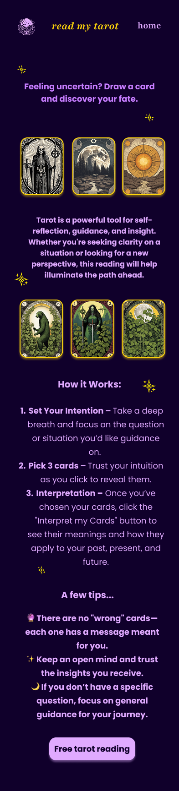

# Tarot Card Reader
Interactive and responsive tarot card reader website built with HTML, Tailwind CSS 4, and vanilla JS. The website is designed in Figma. 

## Features (currently building) 
- Users can select 3 tarot cards.
-	Card Flip Animation – Clicking a card reveals its meaning.
-	View three card tarot reading with explanations
- Users can also ask an AI virtual assistant questions about their tarot reading and it significance.

### AI Chat Functionality Design
 * Open the AI chat window, which allows users to ask questions about their tarot card reading.
 * The AI chat window is a fixed position div on the right hand side of the page.
 * It contains a header, a default AI question, suggested questions, a chat input box, and a send button.
 * When the user types a question into the chat input box and clicks the send button, the AI response is displayed below the chat input box.
 * The AI response is currently a simulated response, but it will eventually call the Gemini API to generate a response.

## Design for Desktop Website 
<a href="https://www.figma.com/design/cC7KADvQAishRHZr4dk7tm/Read-my-tarot-website-design?node-id=42-306&t=ExTKXeyPMxl7k7tI-0">Link to Figma design files</a>
Note: The designs are intended to be guidelines so I plan to make changes as I go along because the goal of this project is to become mroe confident with coding in JS and using a popular framework like Tailwind. 

### Landing page version 1

### Landing page version 2 
I chose to build out this version because it provides more insights into how tarot readings work and guidance for people who are less familiar with how to proceed. 

### Tarot reading website pages (including the design for AI chat)

## Design for Mobile 
      
    
  

## To Do
 -	~Design in Figma – for phone and desktop~
 - ~Flowchart with decision tree for app features~
 - ~Finalise design files~
 - ~Finish building home page with HTML and Tailwind for desktop (minimally responsive with flex)~

-	Generate the card art for all the tarot cards and the associated description
-	Save pathways to card art and descriptions in JSON data file
- Make it responsive for mobile and tablet

## Implementation
-	Load tarot card data from a JSON file.
-	Randomise order of cards (not visible to user) and then show cards to user

## Technologies
-	HTML
-	Tailwind (CSS framework for responsiveness)
-	Vanilla JS – logic for shuffling, selecting + displaying card meanings, also interactions with AI API
-	JSON – storing tarot card data

## My process and what I learned (update this when I'm finished) 
-	UI/UX Design
-	Responsive design 
-	DOM manipulation, event handling, and animations

## Extra features to add in future versions
🔮 Users can choose from different types of tarot readings  
🔮 Randomize card orientation to provide readings on upright or reversed cards
🔮 Add Sound Effects & Background Music  
🔮 Custom Themes – Dark mode, different tarot deck styles.
🔮 Shareable Results – Allow users to share their tarot reading on social media.

## Image and icons attribution
- Background image - Photo by Manny Becerra on Unsplash 
- Crystal Ball by Imogen Oh from <a href="https://thenounproject.com/browse/icons/term/crystal-ball/" target="_blank" title="Crystal Ball Icons">Noun Project</a> (CC BY 3.0)
- Crystal Ball by Soodam Elesti Lee from <a href="https://thenounproject.com/browse/icons/term/crystal-ball/" target="_blank" title="Crystal Ball Icons">Noun Project</a> (CC BY 3.0)
- stars by Faith Henke from <a href="https://thenounproject.com/browse/icons/term/stars/" target="_blank" title="stars Icons">Noun Project</a> (CC BY 3.0)
- Chatbot by kumakamu from <a href="https://thenounproject.com/browse/icons/term/chatbot/" target="_blank" title="Chatbot Icons">Noun Project</a> (CC BY 3.0)
- Ouroboros by Eucalyp from <a href="https://thenounproject.com/browse/icons/term/ouroboros/" target="_blank" title="Ouroboros Icons">Noun Project</a> (CC BY 3.0)

